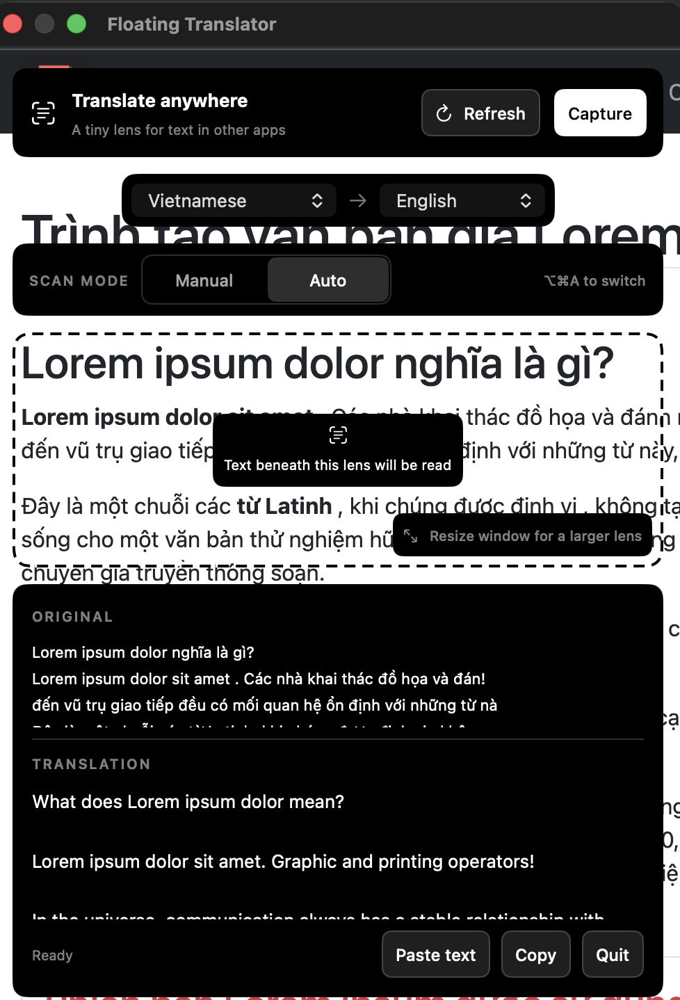

<p align="center">
  
</p>

<h1 align="center">Floating Translator</h1>

<p align="center">
  A tiny floating Mac tool for text that is hard to select or translate.<br>
  Put the lens over the words, capture them, and understand them without leaving your current app.
</p>

<p align="center">
  <strong>macOS 15+</strong> · <strong>Swift</strong> · <strong>No API key</strong> · <strong>MIT licensed</strong>
</p>

Floating Translator starts with **Vietnamese → English**. You can also choose **Thai** or **Malay**, along with other languages supported by Apple's Translation framework. It lives in the Dock and has a compact **translation lens icon** in the menu bar while running.

## Installation

Requires **macOS 15 or later**. No account or API key is needed.

### Install in Applications

1. Get **Floating Translator.app**. If you downloaded the source code, follow [Build from source](#build-from-source) to create it.
2. Drag the app into **Applications**, then open it from there.
3. Click **Enable capture**. In **System Settings → Privacy & Security → Screen Recording**, enable **Floating Translator**. On some macOS versions, this setting is called **Screen & System Audio Recording**.
4. Quit and reopen the app if macOS asks, then move the lens over text. **Auto** scans after you move or resize it; **Refresh** scans again without moving it.

Click the translation lens icon in the menu bar or press **⌥⌘T** to show or hide the window. Apple may ask to download translation languages on first use. **Paste text** works without screen access.

### Updating

Quit the running app using **Quit**, replace the copy in **Applications**, and reopen it there. If access stops working, see [Permission troubleshooting](#permission-troubleshooting).

To open the app at login, add it in **System Settings → General → Login Items**.

## Preview

<p align="center">
  
</p>

Place the lens over text in another app and read the translation below. Refresh to scan the same area again.

## Why I made it

I built this for my own everyday use. Sometimes I come across text inside an app or image that I cannot easily select, and switching to a translation website breaks my flow. I wanted a small window I could move over the words, read the translation, and then get back to what I was doing. I am sharing it in case it helps you too.

## Features

- A movable, resizable lens that stays above other apps.
- A dark monochrome interface with black panels, white text, and a matching dark app icon.
- Vietnamese → English by default, with Thai, Malay, and more language choices.
- Auto Scan by default, with a Manual Capture option, plus menu bar and keyboard shortcuts.
- A **Refresh** button to read and translate the lens again without moving it.
- Complete original text and translation in scrollable panes, with text selection and a Copy button.
- Paste text as a fallback when OCR cannot read the screen.
- On-device translation through macOS, with no account or API key.

## How it works

1. Open Floating Translator. Its small window stays above other apps.
2. Place the outlined lens over the text you want to understand. Drag a window edge or corner to resize the capture area.
3. In **Auto** mode, move or resize the lens to scan. In **Manual** mode, click **Capture** (or press Return). Click **Refresh** whenever you want to read the area again—for example, after new text appears beneath a stationary lens. Both buttons run a fresh capture, text recognition, and translation. The lens stays visible while the app reads the text beneath it, then shows both the original and translation. ScreenCaptureKit excludes the translator window from the captured image.
4. Scroll either result pane to read a longer capture. Use **Copy** to copy the result. If OCR misses something, copy the text yourself and use **Paste text**.

**Auto** is selected each time the app starts. Choose **Manual** in the Scan Mode control when you want to capture only after clicking the button. Opening the app alone does not capture the screen; Auto scans after you move or resize the lens.

## Shortcuts

Click the **translation lens icon** in the top-right menu bar to show or hide the floating window. Hover over it to see **Floating Translator** and its keyboard shortcut. The compact icon fits beside your other menu bar apps and remembers its position between launches. To rearrange it, hold **⌘ Command** and drag it along the menu bar.

| Shortcut | Action |
| --- | --- |
| Menu bar **translation lens icon** | Show or hide the floating window. |
| ⌥⌘T | Show or hide the window from another app. |
| ⌥⌘R | Capture the lens. If the window is hidden, show it first. |
| **Refresh** button | Read and translate the current lens area again. |
| ⌥⌘A | Switch between Manual and Auto Scan. |
| Return | Capture while the translator window is focused. |

The three ⌥⌘ shortcuts are registered only while Floating Translator runs. They use macOS hotkeys and do not need Accessibility or Input Monitoring permission. If another app owns one of those shortcuts, the menu bar button and on-screen controls still work.

## Build from source

1. Install Apple's Command Line Tools if they are not already installed:

   ```sh
   xcode-select --install
   ```

2. Open Terminal in the repository folder and run:

   ```sh
   ./build.sh
   ```

3. Find **Floating Translator.app** in the `build` folder, then follow [Install in Applications](#install-in-applications). Install it before the first launch and screen-access grant.

The build script handles local signing automatically. You do not need to create a certificate yourself or install third-party packages.

<details>
<summary>Developer notes: signing and public releases</summary>

The app uses Apple's AppKit, SwiftUI, Vision, ScreenCaptureKit, Translation, and Carbon frameworks.

Local builds reuse a persistent signing certificate. The first build creates a dedicated private keychain in `~/Library/Application Support/Floating Translator/Signing` and a user-level trust entry scoped to that certificate's code-signing use. Later builds reuse it so macOS can recognize updates as the same app. Keep this directory private, retain it across builds, and back it up. The private key is never placed in this repository.

If you have an Apple Development or Developer ID signing identity, set `CODESIGN_IDENTITY` instead:

```sh
CODESIGN_IDENTITY='your signing identity' ./build.sh
```

The local certificate is for development on your own Mac. Public binary releases should use Developer ID signing and notarization. Changing the signing certificate can require a fresh permission grant.

</details>

## Permissions and privacy

| Access | Why | When |
| --- | --- | --- |
| Screen Recording | macOS requires this to read pixels in another app. | Requested only when you click **Enable capture**. |
| Translation language download | Apple may need to install the chosen language models. | The first time you use a language pair. |

Opening the app and moving the lens do not request permission. The app first performs a passive access check. If permission is missing, Auto waits and the lens shows **Enable capture**. Click that button to authorize the app in System Settings. macOS may require you to quit and reopen after granting access. Once granted, moving or resizing the lens scans automatically. Paste text remains available even without screen access.

macOS may describe Screen Recording as **“screen and audio.”** Floating Translator sets audio capture off and does not request microphone, camera, Accessibility, or contacts access. It takes one display frame, crops it to the lens in memory, and discards the image after OCR. It does not save messages or screenshots. Translation runs through Apple's [on-device Translation framework](https://developer.apple.com/documentation/translation/translationsession).

## Permission troubleshooting

### Why did the permission dialog keep appearing?

During early development, local builds used **ad hoc signing**. Each rebuild changed the app's code identity, so macOS could stop associating it with the permission you had already granted. The Settings toggle could still show the old build as enabled. Repeated capture attempts then brought the dialog back. Apple explains this behavior in its [code identity documentation](https://developer.apple.com/documentation/technotes/tn3127-inside-code-signing-requirements).

The current build reuses a persistent certificate. The app also checks access before capturing, requests permission only through **Enable capture**, and pauses Auto when access is missing or declined. Switching from an old build to the new signing identity may require one fresh grant; ordinary updates using the same identity should retain it.

### Screen Recording is enabled, but capture is blocked

1. Quit all running copies using the app's **Quit** button. Closing the window can leave the menu bar app running.
2. Open the copy in **Applications**, then click **Enable capture** and check its Screen Recording setting. If the app is missing from the list, use **+** to add the installed copy. See [Apple's screen access guide](https://support.apple.com/guide/mac-help/control-access-to-screen-and-system-audio-recording-mchld6aa7d23/mac).
3. Quit and reopen the installed copy after changing access. For local builds, keep the signing directory above and use the same signing certificate for updates.

<details>
<summary>Advanced: clear an old grant or check access without capturing</summary>

If an old, mismatched grant remains stuck, quit the app and reset **only Floating Translator's** Screen Recording grant:

```sh
tccutil reset ScreenCapture dev.phyo.floatingtranslator
```

This removes its current grant. Reopen the installed app, click **Enable capture**, and approve it again. This is a recovery step, not part of routine installation or updates.

For a passive diagnostic without capturing or showing a window, quit the app first, then run:

```sh
open -a 'Floating Translator' --args --diagnose-screen-access
```

The result is written to `~/Library/Application Support/Floating Translator/capture-status.json`; it contains only the app path, version, and whether macOS grants screen access.

</details>

## Notes

- Keep the lens entirely on one display. If OCR misses small text, zoom the source app or use **Paste text**.
- Available language pairs depend on macOS support and installed models. The app checks the chosen pair before translating and explains when the current macOS version does not support it. Malay translation in particular may require a newer macOS release.
- The menu bar shortcut appears while the app runs. If macOS hides it because the menu bar is crowded, use the Dock icon to reopen the window.
- The app does not continuously monitor the screen. Auto Scan is optional and only scans after you move or resize the window.

## Open source

Ideas, bug reports, and pull requests are welcome. See [CONTRIBUTING.md](CONTRIBUTING.md) for build and change notes. The icon and app code are included under the [MIT License](LICENSE).
