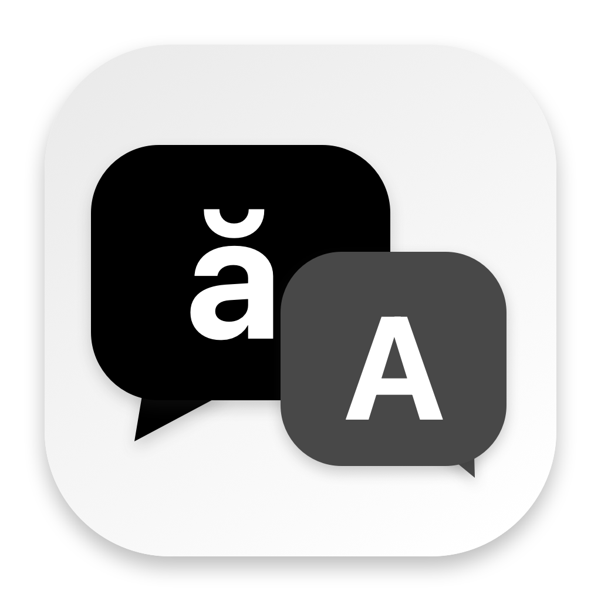

<p align="center">
  
</p>

<h1 align="center">Floating Translator</h1>

<p align="center">
  A tiny floating Mac tool for text that is hard to select or translate.<br>
  Put the lens over the words, capture them, and understand them without leaving your current app.
</p>

<p align="center">
  <strong>macOS 15+</strong> · <strong>Swift</strong> · <strong>No API key</strong> · <strong>MIT licensed</strong>
</p>

Floating Translator starts with **Vietnamese → English**. You can also choose **Thai** or **Malay**, along with other languages supported by Apple's Translation framework. It lives in the Dock and has a **Translate** shortcut in the menu bar while running.

## Why I made it

I built this for my own everyday use. Sometimes I come across text inside an app or image that I cannot easily select, and switching to a translation website breaks my flow. I wanted a small window I could move over the words, read the translation, and then get back to what I was doing. I am sharing it in case it helps you too.

## Features

- A movable, resizable lens that stays above other apps.
- Vietnamese → English by default, with Thai, Malay, and more language choices.
- Auto Scan by default, with a Manual Capture option, plus menu bar and keyboard shortcuts.
- The original text and translation together, with a Copy button.
- Paste text as a fallback when OCR cannot read the screen.
- On-device translation through macOS, with no account or API key.

## How it works

1. Open Floating Translator. Its small window stays above other apps.
2. Place the outlined lens over the text you want to understand. Drag a window edge or corner to resize the capture area.
3. In **Auto** mode, move or resize the lens to scan. In **Manual** mode, click **Capture** (or press Return). The window briefly hides, reads the text beneath it, then shows both the original and translation.
4. Use **Copy** to copy the result. If OCR misses something, copy the text yourself and use **Paste text**.

**Auto** is selected each time the app starts. Choose **Manual** in the Scan Mode control when you want to capture only after clicking the button. Opening the app alone does not capture the screen; Auto scans after you move or resize the lens.

## Shortcuts

| Shortcut | Action |
| --- | --- |
| Menu bar **Translate** button | Show or hide the floating window. |
| ⌥⌘T | Show or hide the window from another app. |
| ⌥⌘R | Capture the lens. If the window is hidden, show it first. |
| ⌥⌘A | Switch between Manual and Auto Scan. |
| Return | Capture while the translator window is focused. |

The three ⌥⌘ shortcuts are registered only while Floating Translator runs. They use macOS hotkeys and do not need Accessibility or Input Monitoring permission. If another app owns one of those shortcuts, the menu bar button and on-screen controls still work.

## Build

Install the Apple Command Line Tools if needed (`xcode-select --install`), then run:

```sh
./build.sh
open 'build/Floating Translator.app'
```

The result is `build/Floating Translator.app`. You can drag that app into Applications. The build uses only Apple's AppKit, SwiftUI, Vision, ScreenCaptureKit, and Translation frameworks. No package install, account, or API key is required.

Local builds reuse a persistent signing certificate. The first build creates a dedicated private keychain in `~/Library/Application Support/Floating Translator/Signing` and a user-level trust entry scoped to that certificate's code-signing use. Later builds reuse it, so macOS can recognize updates as the same app. The private key is never placed in this repository. Back up that signing directory if you want to preserve the identity when moving to another Mac.

If you have an Apple Development or Developer ID signing identity, set `CODESIGN_IDENTITY` instead:

```sh
CODESIGN_IDENTITY='your signing identity' ./build.sh
```

The local certificate is for development on your own Mac. Public binary releases should use Developer ID signing and notarization.

If you want the app at login, add it through **System Settings → General → Login Items**. The app does not add itself automatically.

## Permissions and privacy

| Access | Why | When |
| --- | --- | --- |
| Screen Recording | macOS requires this to read pixels in another app. | Requested only when you click **Enable capture**. |
| Translation language download | Apple may need to install the chosen language models. | The first time you use a language pair. |

Opening the app and moving the lens do not request permission. The app first performs a passive access check. If permission is missing, Auto waits and the lens shows **Enable capture**. Click that button to authorize the app in System Settings. macOS may require you to quit and reopen after granting access. Once granted, moving or resizing the lens scans automatically. Paste text remains available even without screen access.

macOS may describe Screen Recording as **“screen and audio.”** Floating Translator sets audio capture off and does not request microphone, camera, Accessibility, or contacts access. It takes one display frame, crops it to the lens in memory, and discards the image after OCR. It does not save messages or screenshots. Translation runs through Apple's [on-device Translation framework](https://developer.apple.com/documentation/translation/translationsession).

If you previously used an ad hoc signed version, switching to the persistent certificate requires one fresh grant. An old Settings toggle can refer to the earlier identity. Keep using the same signing certificate and the installed copy in Applications so subsequent local updates satisfy the same [macOS code identity](https://developer.apple.com/documentation/technotes/tn3127-inside-code-signing-requirements).

For a passive diagnostic without capturing or showing a window:

```sh
open -a 'Floating Translator' --args --diagnose-screen-access
```

Quit the app first. The result is written to `~/Library/Application Support/Floating Translator/capture-status.json`; it contains only the app path, version, and whether macOS grants screen access.

## Notes

- Keep the lens entirely on one display. If OCR misses small text, zoom the source app or use **Paste text**.
- Available language pairs depend on macOS support and installed models. The app checks the chosen pair before translating and explains when the current macOS version does not support it. Malay translation in particular may require a newer macOS release.
- The menu bar shortcut appears while the app runs. If macOS hides it because the menu bar is crowded, use the Dock icon to reopen the window.
- The app does not continuously monitor the screen. Auto Scan is optional and only scans after you move or resize the window.

## Open source

Ideas, bug reports, and pull requests are welcome. See [CONTRIBUTING.md](CONTRIBUTING.md) for build and change notes. The icon and app code are included under the [MIT License](LICENSE).
